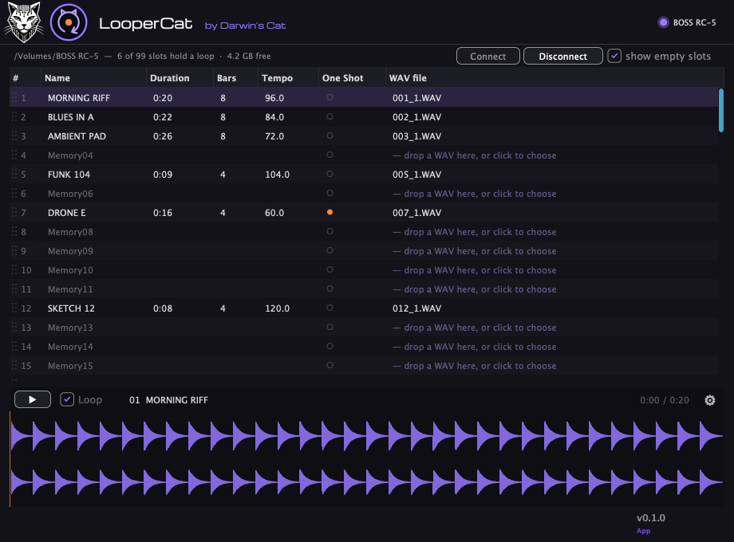

# Looper Cat 🐾

**See inside your looper.** LooperCat is a companion app for the BOSS RC-5:
browse all 99 memory slots, listen to loops, rename, trim, re-tempo, upload and
download WAVs — while the app drives the pedal's STORAGE mode for you.

[](LICENSE)



Part of the [Felitronics](https://darwinscat.com/felitronics) family by
[Darwin's Cat](https://darwinscat.com). Built on the RC-5 file-format
knowledge of [rc5cat](https://github.com/AliceLafox/rc5cat).

> **Beta.** Everything below is verified against real hardware, and every write
> runs behind automatic backups — but treat v0.x like the beta it is.

## What it does

- **Connect / Disconnect.** One button puts the pedal into STORAGE mode and
  mounts it; one button ejects politely and returns it to the looper screen —
  over USB-MIDI SysEx, with zero trips through the pedal's SETUP menu.
- **Browse.** All 99 slots in one table: name, duration, bars, tempo, one-shot,
  WAV file. Live refresh as the pedal comes and goes.
- **Listen.** Double-click a slot to play it — waveform, seeking, output device
  picker. No copying files around just to hear what's in slot 37.
- **Edit.** Inline rename, one-shot toggle, tempo and bars, trim with a gapless
  preview of the cut, clear a slot, drag one slot onto another to swap them.
- **Move audio.** Push a WAV into an empty slot or replace an occupied one
  (converted to the pedal's canonical float32 format; the old loop goes to the
  app's trash first), pull any loop out as a standard WAV.
- **Stay safe.** Config backups before every mutation, write-generation counters
  matching the pedal's own discipline, junk-file hygiene (macOS AppleDouble
  droppings), a doctor that checks card consistency — and honest ghost detection
  with automatic cleanup when the pedal leaves without saying goodbye.

The whole map, feature by feature: [docs/guide.md](docs/guide.md).

## Why your tempo looks weird (and what we do about it)

When you import a WAV through the card, the RC-5 assumes the loop is a
power-of-two number of measures — 16, 32, 64… — so any other loop gets a wrong
tempo, and the onboard rhythm drifts against the actual music. LooperCat makes
the arithmetic visible — the Bars column — and editable: set the true tempo and
bars on any slot, and the pedal's rhythm finally agrees with the music.
Automatic tempo-true upload (the right numbers written the moment a WAV lands)
is next on the roadmap (#26, #28).

## The STORAGE story

The RC-5 talks to a computer by exporting its SD card as a USB drive — but only
after a manual trip through SETUP → USB → STORAGE on the pedal, every single
time. It turns out that mode can be flipped remotely, and LooperCat speaks the
protocol: **Connect** sends the SysEx, waits for the medium, and mounts the
volume; **Disconnect** unmounts and sends the pedal back to looping. The
protocol notes live in [docs/midi-protocol](docs/midi-protocol/).

## Install

macOS first: grab the DMG from [Releases](../../releases), drag LooperCat to
Applications, plug the RC-5 in over USB, press **Connect**. Universal binary
(Apple silicon + Intel). A Windows build is planned once the macOS release
settles.

## Building from source

```sh
cmake -B build -DCMAKE_BUILD_TYPE=Release
cmake --build build --target LooperCat
ctest --test-dir build
```

JUCE and felitronics-appkit are fetched automatically; the app lands in
`build/LooperCat_artefacts/`.

## Supported hardware

BOSS RC-5, developed and verified against a single real unit on firmware
Ver 1.10 build 0050 (the current official release). The format layer
is pinned by conformance tests against values captured from live hardware —
the golden fixtures checked in at `fixtures/golden.json`, shared lineage with
[rc5cat](https://github.com/AliceLafox/rc5cat). Other RC-series pedals
(RC-500, RC-505…) are **not supported**: their cards look alike — alike
enough to *seem* to work — but speak a different data dialect, so LooperCat
checks who it is talking to and refuses a foreign card with an honest message
instead of guessing (#35).

## License

[AGPL-3.0](LICENSE). LooperCat is built with [JUCE](https://juce.com) under
GPLv3; GPLv3 code may be conveyed inside an AGPLv3 work (GPLv3 §13), so the
combination is distribution-safe.

LooperCat is an independent project: not affiliated with, endorsed, or
sponsored by any hardware manufacturer; all trademarks belong to their
respective owners. "BOSS RC-5" is used nominatively to state compatibility.

Bugs and wishes → [issues](../../issues); everything else →
[band@darwinscat.com](mailto:band@darwinscat.com).
